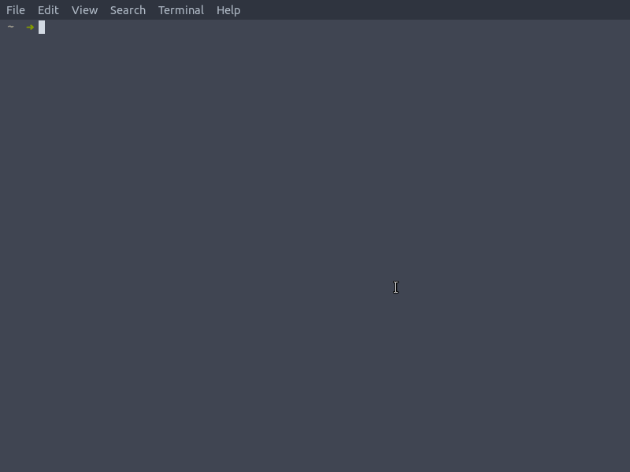

[](https://github.com/koffeinfrei/should-i-watch-this/releases)
[](https://github.com/koffeinfrei/should-i-watch-this/actions?workflow=Crystal+CI)


# Should I Watch This?

A tool to ask the internet if it's worth watching this movie.

There are 3 versions to this:

- [a CLI](#1.-cli)
- [a web application](#2.-web-aplication-at-should-i-watch-this.com)
- [an openfaas function](#3.-openfaas-function)

### 1. CLI



### 2. Web aplication at should-i-watch-this.com


### 3. OpenFaaS function

```bash
# basic example
curl -H 'X-Auth-Token: <your omdb token>' \
    https://faasd.koffeinfrei.org/function/should-i-watch-this \
    -d "the terminator"

# example with parameters
curl -H 'X-Auth-Token: <your omdb token>' \
    https://faasd.koffeinfrei.org/function/should-i-watch-this?show_links=true\&year=1984 \
    -d "the terminator"

# example with json response
curl -H 'X-Auth-Token: <your omdb token>' \
    -H "Accept: application/json" \
    https://faasd.koffeinfrei.org/function/should-i-watch-this?show_links=true\&year=1984 \
    -d "the terminator"
```

## About

It uses the [OMDb API](http://www.omdbapi.com) to get basic information about
the movie.

The ratings are fetched from the following sources:

- [IMDb](https://www.imdb.com)
- [Rotten Tomatoes](https://www.rottentomatoes.com)
- [Metacritic](https://www.metacritic.com)


## Usage

### CLI

1. Get an [OMDb API key](http://www.omdbapi.com/apikey.aspx) (one time)

2. Install binary (one time)

   First you'll need to [install
Crystal](https://crystal-lang.org/reference/installation/).

   ```bash
   $ git clone git@github.com:koffeinfrei/should-i-watch-this.git
   $ cd should-i-watch-this
   $ shards build --release
   $ cp bin/should-i-watch-this <some directory in your $PATH>
   ```

3. Execute binary

   ```bash
   # search by title
   $ should-i-watch-this lookup "terminator 2"

   # search by imdb id
   $ should-i-watch-this lookup tt0103064
   ```

### Web application

1. Go to https://www.should-i-watch-this.com

2. Type the title or the IMDb id in the search box

3. Hit the search button.

### OpenFaaS function

1. Get an [OMDb API key](http://www.omdbapi.com/apikey.aspx) (one time)

2. Call the function

   There a some headers and query params to the function:

   - mandatory
     - header `X-Auth-Token`: the OMDb API key
   - optional
     - query param `show_links`: value "true" to include the source links
       in the response
     - query param `year`: the year of the movie

   ```bash
   # basic example
   curl -H 'X-Auth-Token: <your omdb token>' \
       https://faasd.koffeinfrei.org/function/should-i-watch-this \
       -d "the terminator"

   # example with parameters
   curl -H 'X-Auth-Token: <your omdb token>' \
       https://faasd.koffeinfrei.org/function/should-i-watch-this?show_links=true\&year=1984 \
       -d "the terminator"

   # example with json response
   curl -H 'X-Auth-Token: <your omdb token>' \
       -H "Accept: application/json" \
       https://faasd.koffeinfrei.org/function/should-i-watch-this?show_links=true\&year=1984 \
       -d "the terminator"
   ```

## Development

### CLI

```bash
$ git clone git@github.com:koffeinfrei/should-i-watch-this.git
$ shards install
```

### Web application
```bash
$ npm install
$ npm run dev
```

Navigate to [localhost:5000](http://localhost:5000).

#### Deployment

##### Preparation (one time)

1. `cp .env.example .env`
2. Fill in appropriate values in `.env`

##### Deploy

1. `npm run dist`

### OpenFaaS function

#### Deployment

##### Preparation (one time)

```bash
export OPENFAAS_URL=https://faasd.koffeinfrei.org
faas template store pull crystal-http --overwrite
```

##### Deploy

```bash
faas-cli up --no-cache
```

## Contributing

1. Fork it (<https://github.com/koffeinfrei/should-i-watch-this/fork>)
2. Create your feature branch (`git checkout -b my-new-feature`)
3. Commit your changes (`git commit -am 'Add some feature'`)
4. Push to the branch (`git push origin my-new-feature`)
5. Create a new Pull Request

Made with ☕️  by [Koffeinfrei](https://github.com/koffeinfrei)
